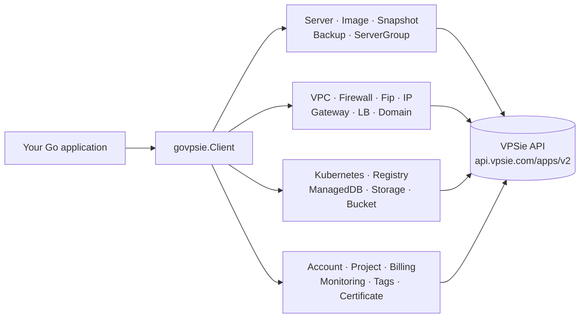
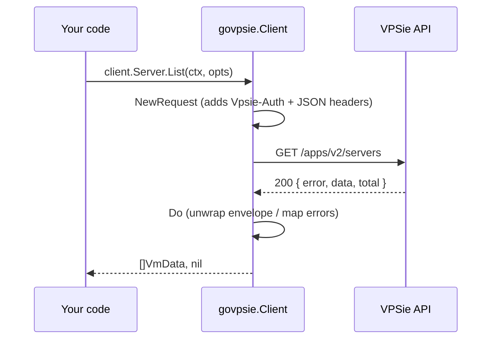

# govpsie

[](https://pkg.go.dev/github.com/vpsie/govpsie)
[](go.mod)
[](LICENSE)

`govpsie` is the official Go client library for the [VPSie](https://vpsie.com)
cloud API. It provides typed access to servers, storage, networking, DNS, load
balancers, Kubernetes, container registries, managed databases and more, and is
the SDK that powers the
[VPSie Terraform provider](https://github.com/vpsie/terraform-provider-vpsie).

## Contents

- [Architecture](#architecture) · [Requirements](#requirements) · [Installation](#installation) · [Authentication](#authentication)
- [Services](#services) · [Usage examples](#usage-examples) · [Pagination](#pagination) · [Error handling](#error-handling)
- [Runnable example](#runnable-example) · [Testing](#testing) · [Contributing](#contributing) · [License](#license)

## Architecture



Every service is reached through a single `*govpsie.Client`. A request flows
`Client.NewRequest` → `Client.Do`, which unwraps the standard response envelope
`{ "error": bool, "data": ..., "total": int }` and turns a non-2xx status into a
Go `error` carrying the API message.



## Requirements

- [Go](https://go.dev/doc/install) 1.24 or newer
- A VPSie API access token

## Installation

```sh
go get github.com/vpsie/govpsie
```

## Authentication

The API authenticates with a `Vpsie-Auth` header. Requests are made over an
`*http.Client`; pair it with `golang.org/x/oauth2` (or any `*http.Client`) and
set the token via `SetRequestHeaders`:

```go
package main

import (
	"context"
	"fmt"
	"log"
	"os"

	"github.com/vpsie/govpsie"
	"golang.org/x/oauth2"
)

func main() {
	client := govpsie.NewClient(oauth2.NewClient(context.Background(), nil))
	client.SetRequestHeaders(map[string]string{
		"Vpsie-Auth": os.Getenv("VPSIE_ACCESS_TOKEN"),
	})

	servers, err := client.Server.List(context.Background(), &govpsie.ListOptions{})
	if err != nil {
		log.Fatal(err)
	}

	for _, s := range servers {
		fmt.Printf("%s (%s)\n", s.Hostname, s.Identifier)
	}
}
```

Issue an access token from the VPSie console, or via
`POST /auth/from/api` with your `clientId` and `clientSecret`. Never hard-code a
token — read it from the environment or a secret store.

## Services

| Service | Field | Highlights |
| --- | --- | --- |
| Account | `client.Account` | Account details |
| Project | `client.Project` | Projects and membership |
| Server | `client.Server` | VM lifecycle, power, resize |
| Image | `client.Image` | Custom images |
| Snapshot | `client.Snapshot` | Server snapshots and policies |
| Backup | `client.Backup` | Backups and backup policies |
| Storage | `client.Storage` | Block storage and snapshots |
| Bucket | `client.Bucket` | Object storage buckets |
| SSH Key | `client.SShKey` | SSH keys |
| Script | `client.Scripts` | Startup scripts |
| Domain | `client.Domain` | DNS zones and records |
| IP / FIP | `client.IP` / `client.Fip` | IPs and floating IPs |
| Firewall | `client.Firewall` / `client.FirewallGroup` | Firewalls and groups |
| Gateway | `client.Gateway` | Internet gateways |
| VPC | `client.VPC` | Virtual private clouds |
| Load Balancer | `client.LB` | Load balancers |
| Kubernetes | `client.K8s` | Managed Kubernetes clusters and node groups |
| Registry | `client.Registry` | Container registries |
| Managed DB | `client.ManagedDB` | Managed database clusters |
| Server Group | `client.ServerGroup` | Server (VM) groups |
| Tags | `client.Tags` | Resource tags |
| Certificate | `client.Certificate` | TLS certificates |
| Monitoring | `client.Monitoring` | Monitoring rules |
| Billing | `client.Billing` | Billing information |
| Data Center | `client.DataCenter` | Available datacenters |
| Access Token | `client.AccessToken` | API access tokens |
| Profile | `client.Profile` | User profile |
| Logs | `client.Logs` | Activity logs |
| Pending | `client.Pending` | Pending operations |

## Usage examples

Create and tag a resource:

```go
ctx := context.Background()

// Create a reusable tag.
tagID, err := client.Tags.Create(ctx, "production", "#ff0000")
if err != nil {
	log.Fatal(err)
}
fmt.Println("tag:", tagID)

// Create a container registry.
if err := client.Registry.Create(ctx, "my-registry", "ams1", "plan-identifier"); err != nil {
	log.Fatal(err)
}
```

Provision and scale a managed database:

```go
err := client.ManagedDB.Create(ctx, &govpsie.CreateManagedDBRequest{
	Name:         "app-db",
	DBType:       "mysql",
	DcIdentifier: "ams1",
	PlanID:       1,
	NodeCount:    1,
})
if err != nil {
	log.Fatal(err)
}

// Scale out by one node.
if err := client.ManagedDB.AddNode(ctx, "cluster-identifier"); err != nil {
	log.Fatal(err)
}
```

## Pagination

List methods that support paging accept `*govpsie.ListOptions`:

```go
opts := &govpsie.ListOptions{Page: 1, PerPage: 50}
storages, err := client.Storage.List(ctx, opts)
```

> Note: paginated endpoints translate `Page` to the API's `offset` and `PerPage`
> to `limit` (i.e. `Page` is a record offset, not a 1-based page index).

## Error handling

`Client.Do` returns an `error` for any non-2xx response, using the API's
`message` field. A `204 No Content` is treated as success with no body.

```go
if _, err := client.Server.Get(ctx, "does-not-exist"); err != nil {
	// err.Error() contains the API-provided message.
}
```

## Runnable example

A complete, runnable program lives in [`examples/basic`](examples/basic). It
lists your datacenters and servers:

```sh
export VPSIE_ACCESS_TOKEN="your-api-token"
go run ./examples/basic
```

Common developer tasks are wrapped in the [`Makefile`](Makefile):

```sh
make          # fmt, vet, build, test
make test     # run tests
make build    # compile all packages
```

## Testing

Unit tests run without credentials. Tests that talk to the live API are gated
behind environment variables and are skipped otherwise:

```sh
go test ./...

# Run the live tests (creates/mutates real resources):
VPSIE_ACCESS_TOKEN="your-token" go test ./... -v
```

## Contributing

1. Fork the repository and create a feature branch.
2. Keep changes small and focused; match the existing service pattern
   (interface + handler + typed request/response envelopes).
3. Run `go build ./...`, `go vet ./...` and `go test ./...` before opening a PR.

## License

Distributed under the GNU General Public License v3.0. See [LICENSE](LICENSE).
